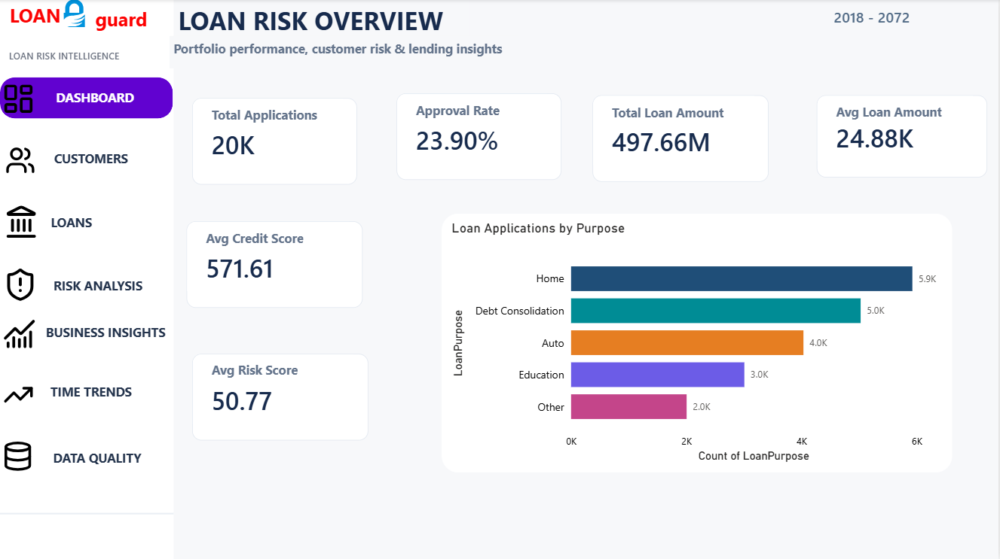
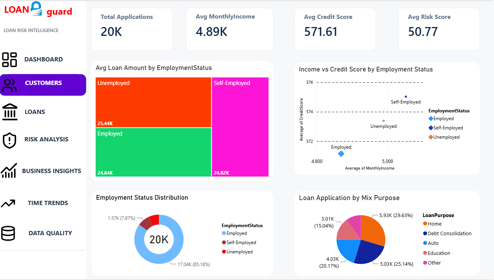
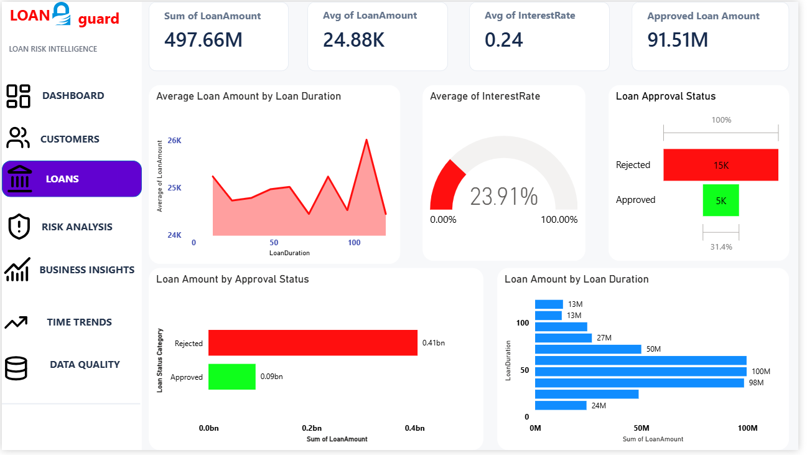
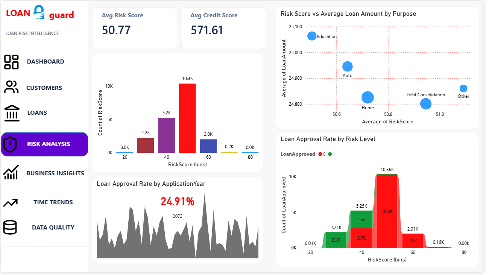
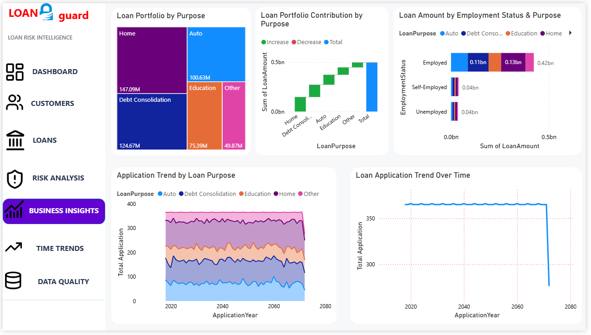
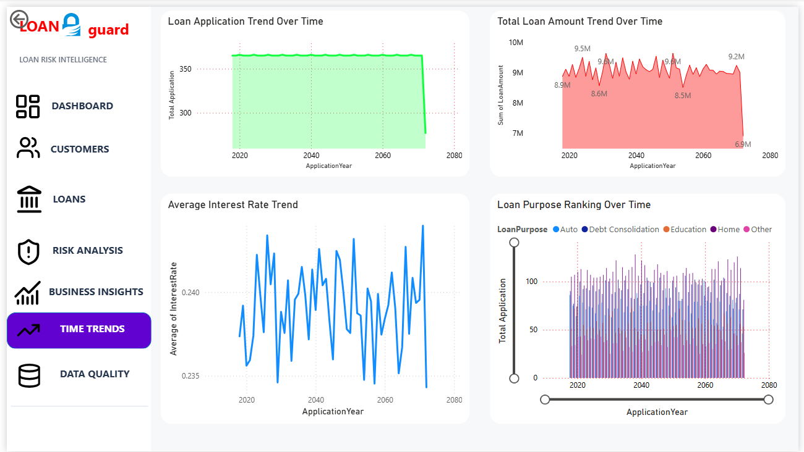
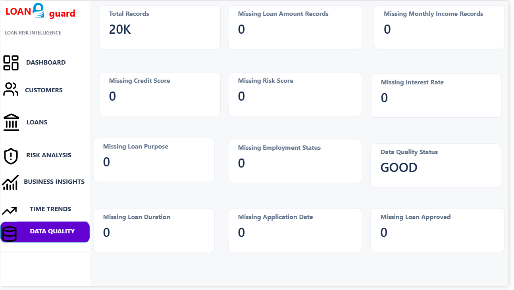

# LoanGuard — Banking Risk & Customer Analytics

LoanGuard is an end-to-end banking loan analytics project designed to analyze loan applications, customer profiles, loan portfolios, approval patterns, credit risk, and business trends.

The project combines **Python, MySQL, Power BI, and DAX** to clean, validate, analyze, and visualize banking loan data through an interactive 7-page Power BI dashboard.

---

## 🎯 Business Objectives

- Analyze overall loan application and approval performance
- Understand customer income and credit profiles
- Analyze loan portfolio distribution by purpose
- Identify credit and risk patterns
- Evaluate loan approval behavior
- Track loan application and financial trends over time
- Validate data quality and completeness
- Generate actionable business insights for banking decision-making

---

## 📊 Dataset

- Approximately **20,000 loan applications**
- **40+ analytical attributes** after data preparation
- Customer financial information
- Credit and risk information
- Loan amount and duration
- Interest rate
- Employment status
- Loan purpose
- Application date
- Loan approval status

---

## 🛠️ Tools & Technologies

- **Python** — Data cleaning, validation, EDA and risk analysis
- **Pandas** — Data manipulation and preprocessing
- **MySQL** — SQL-based analysis and data management
- **Power BI** — Interactive dashboard and visualization
- **DAX** — KPI calculations and business metrics
- **Excel / CSV** — Source data

---

## 🔄 Project Workflow

```text
Raw Loan Data
      ↓
Data Audit
      ↓
Data Cleaning
      ↓
Data Validation
      ↓
Exploratory Data Analysis
      ↓
Risk Analysis
      ↓
MySQL Analysis
      ↓
Power BI Data Modeling
      ↓
DAX KPI Development
      ↓
Interactive 7-Page Dashboard
      ↓
Business Insights
```

---

# 📈 Dashboard Pages

## 1. Executive Overview

Provides a high-level view of the banking loan portfolio.

### Key KPIs

- **Total Applications:** 20K
- **Loan Approval Rate:** 24%
- **Total Loan Amount:** 497.66M
- **Average Loan Amount:** 24.88K
- **Average Credit Score:** 571.61
- **Average Risk Score:** 50.77

Includes loan-purpose analysis and overall portfolio performance.

---

## 2. Customer Analytics

Analyzes customer financial and employment characteristics.

### Analysis Includes

- Employment status distribution
- Customer income analysis
- Credit score analysis
- Risk score analysis
- Loan purpose distribution
- Relationship between income and credit score

---

## 3. Loan Analysis

Focuses on loan portfolio characteristics and lending patterns.

### Analysis Includes

- Total loan amount
- Average loan amount
- Average interest rate
- Approved loan amount
- Average loan amount by loan duration

---

## 4. Risk Analysis

Analyzes credit and lending risk patterns.

### Analysis Includes

- Risk score distribution
- Risk score vs loan amount
- Loan approval rate by risk level
- Loan approval performance over time
- Credit and risk profile analysis

---

## 5. Business Insights

Provides business-oriented portfolio and lending insights.

### Analysis Includes

- Loan portfolio by purpose
- Loan amount by employment status
- Loan purpose contribution
- Application trends by loan purpose

---

## 6. Time Trends

Analyzes how loan activity changes over time.

### Analysis Includes

- Loan application trend
- Total loan amount trend
- Average interest rate trend
- Approval performance trends

---

## 7. Data Quality

Validates the completeness and quality of the analytical dataset.

### Data Quality Checks

- Missing Loan Amount
- Missing Monthly Income
- Missing Credit Score
- Missing Risk Score
- Missing Interest Rate
- Missing Loan Purpose
- Missing Employment Status
- Missing Loan Duration
- Missing Application Date
- Missing Loan Approval Status

### Overall Data Quality

**GOOD**

All monitored critical fields contain zero missing values.

---

# 💡 Key Business Insights

- The overall loan approval rate is approximately **24%**.
- The analyzed portfolio contains approximately **497.66M** in total loan amount.
- Credit score and risk score provide important indicators for evaluating loan applications.
- Loan purpose contributes differently to the overall lending portfolio.
- Employment status influences the composition of the loan portfolio.
- Application and loan amount trends provide visibility into changing lending activity.
- Data quality validation confirms that monitored critical fields contain no missing values.

---

# 📐 DAX & KPI Development

The Power BI dashboard uses DAX measures for dynamic business calculations including:

- Total Applications
- Loan Approval Rate
- Total Loan Amount
- Average Loan Amount
- Average Credit Score
- Average Risk Score
- Average Interest Rate
- Approved Loan Amount
- Missing-value validation
- Data Quality Status

### Example DAX Measure

```DAX
Approved Loan Amount =
CALCULATE(
    SUM('LoanGuard loan_applications'[LoanAmount]),
    'LoanGuard loan_applications'[LoanApproved] = 1
)
```

---

# 🧹 Data Quality & Validation

The project includes a dedicated data validation workflow to ensure analytical reliability.

### Validation Covers

- Missing values
- Data types
- Business rules
- Loan approval values
- Financial field validation
- Credit and risk score validation
- Date validation
- Data consistency checks

The final Power BI Data Quality page reports **GOOD** status with zero missing values across the monitored critical fields.

---

# 📁 Project Structure

```text
LoanGuard-Banking-Risk-Analytics/
│
├── README.md
│
├── data/
│
├── python/
│   ├── data_audit.py
│   ├── data_cleaning.py
│   ├── data_validation.py
│   ├── eda.py
│   └── risk_analysis.py
│
├── sql/
│
├── powerbi/
│
└── screenshots/
    ├── executive-overview.png
    ├── customer-analytics.png
    ├── loan-analysis.png
    ├── risk-analysis.png
    ├── business-insights.png
    ├── time-trends.png
    └── data-quality.png
```

---

# 🖼️ Dashboard Preview

## Executive Overview



## Customer Analytics



## Loan Analysis



## Risk Analysis



## Business Insights



## Time Trends



## Data Quality



---

# 🚀 Future Improvements

- Automated loan risk scoring
- Machine learning-based approval prediction
- Automated anomaly detection
- Real-time banking risk monitoring
- Automated email alerts for high-risk applications
- Advanced customer segmentation
- Predictive loan default analysis

---

# 👨‍💻 Author

**Shivanand Birajdar**

**Data Analytics | Python | SQL | Power BI | DAX | Machine Learning**

GitHub: [shivanand-b](https://github.com/shivanand-b)

---

⭐ If you find this project useful, consider giving it a star.
